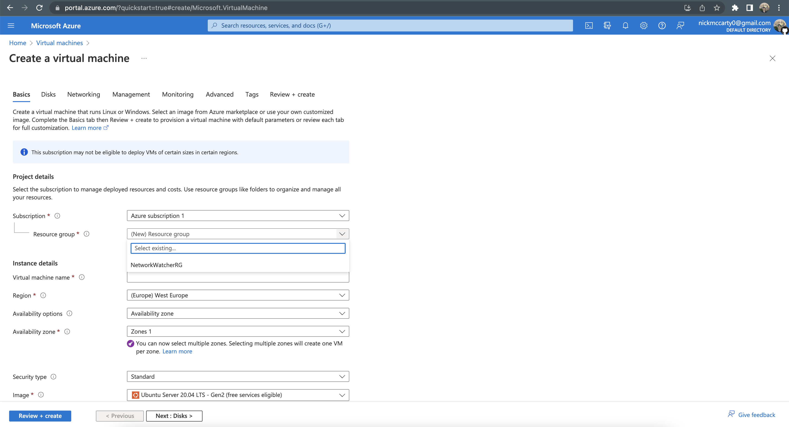
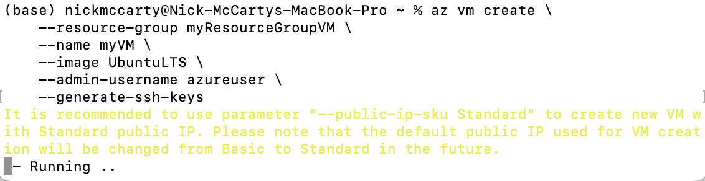
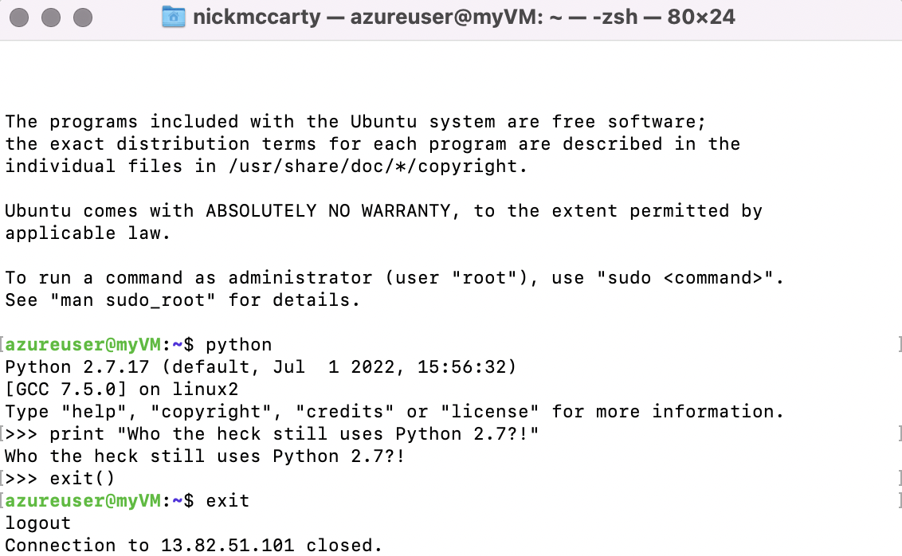
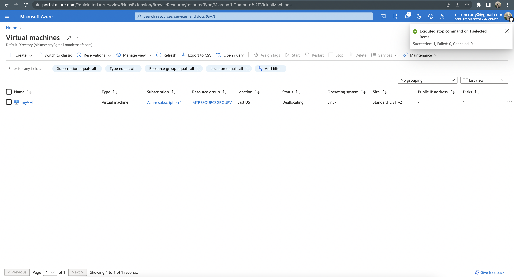
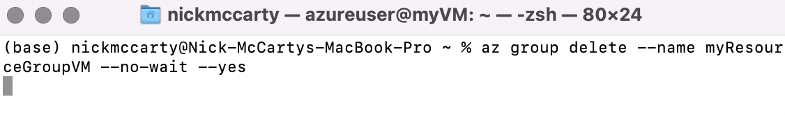

# Create and Manage Linux Virtual Machines (VMs)

##### [Source](https://docs.microsoft.com/en-us/azure/virtual-machines/linux/tutorial-manage-vm)

 

<table width = "100%">
    <tr>
        <td>
             
        </td>
        <td>
            
        </td>
    </tr>
</table>

## Contents

* [Create resource group](#create-resource-group)
* [Create virtual machine](#create-virtual-machine)
* [Connect to VM](#connect-to-virtual-machine)
* [Find the power state](#power-state)
* [Stop virtual machine](#stop-virtual-machine)
* [Deleting VM resources](#delete-vm-resources)

## Create Resource Group

Create a resource group with the [az group create](https://docs.microsoft.com/en-us/cli/azure/vm) command.

An Azure resource group is a logical container into which Azure resources are deployed and managed. A resource group must be created before a virtual machine. In this example, a resource group named `myResourceGroupVM` is created in the `eastus` region.

<table width = "100%">
    <tr>
        <td>
             
        </td>
        <td>
            
        </td>
    </tr>
</table>

The resource group is specified when creating or modifying a VM, which can be seen throughout this tutorial.

**Note:** *This step presupposes that you've successfully signed into your Azure account using the CLI*:

## Create Virtual Machine

Create a virtual machine with the [az vm create](https://docs.microsoft.com/en-us/cli/azure/vm) command.

When you create a virtual machine, several options are available such as operating system image, disk sizing, and administrative credentials. The following example creates a VM named `myVM` that runs Ubuntu Server. A user account named `azureuser` is created on the VM, and SSH keys are generated if they do not exist in the default key location (*~/.ssh*):

<table width = "100%">
    <tr>
        <td>
             
        </td>
        <td>
            
        </td>
    </tr>
</table>

It may take a few minutes to create the VM. Once the VM has been created, the Azure CLI outputs information about the VM. Take note of the `publicIpAddress`, this address can be used to access the virtual machine.

<table width = "100%">
    <tr>
        <td>
             
        </td>
        <td>
            
        </td>
    </tr>
</table>

## Connect to VM

You can now connect to the VM with SSH in the Azure Cloud Shell or from your local computer. Replace the example IP address with the `publicIpAddress` noted in the previous step.

<table width = "100%">
    <tr>
        <td>
             
        </td>
        <td>
            
        </td>
    </tr>
</table>

Once logged in to the VM, you can install and configure applications. When you are finished, you close the SSH session as normal:

<table width = "100%">
    <tr>
        <td>
             
        </td>
        <td>
            
        </td>
        <td>
            
        </td>
    </tr>
</table>

## Power State

An Azure VM can have one of many power states. This state represents the current state of the VM from the standpoint of the hypervisor.

<table width = "70%">
  <thead>
    <tr>
      <th>Power State</th>
      <th>Description</th>
    </tr>
  </thead>
  <tbody>
    <tr>
      <td>Starting</td>
      <td>Indicates the virtual machine is being started.</td>
    </tr>
    <tr>
      <td>Running</td>
      <td>Indicates that the virtual machine is running.</td>
    </tr>
    <tr>
      <td>Stopping</td>
      <td>Indicates that the virtual machine is being stopped.</td>
    </tr>
    <tr>
      <td>Stopped</td>
      <td>Indicates that the virtual machine is stopped. Virtual machines in the stopped state still incur compute charges.</td>
    </tr>
    <tr>
      <td>Deallocating</td>
      <td>Indicates that the virtual machine is being deallocated.</td>
    </tr>
    <tr>
      <td>Deallocated</td>
      <td>Indicates that the virtual machine is removed from the hypervisor but still available in the control plane. Virtual machines in the Deallocated state do not incur compute charges.</td>
    </tr>
    <tr>
      <td>-</td>
      <td>Indicates that the power state of the virtual machine is unknown.</td>
    </tr>
  </tbody>
</table>

To retrieve the state of a particular VM, use the [az vm get-instance-view](https://docs.microsoft.com/en-us/cli/azure/vm) command. Be sure to specify a valid name for a virtual machine and resource group.

## Stop VM

Stopping the VM using the GUI:

<table width = "100%">
    <tr>
        <td>
             
        </td>
        <td>
            
        </td>
    </tr>
</table>

Stopping the VM using the CLI:

## Delete VM Resources

You can delete a VM, but by default this only deletes the VM resource, not the disks and networking resources the VM uses. You can change the default behavior to delete other resources when you delete the VM. For more information, see [Delete a VM and attached resources](https://docs.microsoft.com/en-us/azure/virtual-machines/delete).

Deleting a resource group also deletes all resources contained within, such as the VM, virtual network, and disk. The `--no-wait` parameter returns control to the prompt without waiting for the operation to complete. The `--yes` parameter confirms that you wish to delete the resources without an additional prompt to do so.

This can also be performed using the GUI, of course:

